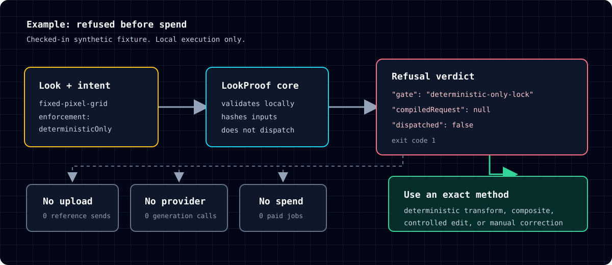

# Case study: what LookProof proved, and what it did not

LookProof compiled a generic request, refused a spatial lock before any generation, and then two image models still drifted identity. That is the result. It is not a consistency win.

This page is prose only. The generated study images are not published here and are not LookProof success examples.

## What was asked

A programmatic, public-safe field-archivist drawing was the only reference. The identity lock required one adult, a short geometric silver bob, a mustard crescent headband, one teal pin, magenta sleeves under a teal vest, navy trousers, mustard block boots, and exactly one mustard specimen case.

A second lock required the orange strap to start on the subject's anatomical right shoulder and end at that case on the anatomical left hip. That lock was marked `deterministicOnly`. LookProof is not allowed to compile it into a generative request.

The same short user prompt was used twice per model:

- baseline: the user prompt only
- compiled: LookProof's frozen policy prefix, then the same user prompt

The two model families were Nano Banana Pro and FLUX.2 Pro. Four paid outputs were authorized. Zero retries were authorized.

## What LookProof did before spend

Both bindings compiled the identity request locally. `dispatched` stayed `false`. The compiled prefix contained the identity clauses. The two request hashes differed only because the inert model bindings differed.

Both case-side requests exited `1` with gate `deterministic-only-lock` and `compiledRequest: null`. No upload and no paid job was created for that lock. That refusal is the control. It is the part LookProof can own.

The diagram uses the checked-in synthetic fixture, not private study material. The [shared-core example](shared-core-example.md) provides the exact CLI command, equivalent MCP arguments, sanitized verdict, and equality-test location.

A later mechanical `check` on each generated PNG passed. That check reads the 24-byte signature and IHDR only. It does not inspect pixels, identity, costume, or text.

## What the images did

An independent reviewer inspected the four outputs at full resolution. Mechanical format pass was not treated as a visual pass. Artist labels were not inherited.

All four were `REVISE`. None were `PASS`.

- Nano Banana Pro baseline inverted the vest-on-top construction (magenta jacket over a teal sweater).
- Nano Banana Pro compiled added a cream mat on all four edges and restyled the helmet-bob into a softer swept bob.
- FLUX.2 Pro baseline used an open O-mouth instead of a calm attentive face.
- FLUX.2 Pro compiled replaced the short geometric bob and block boots with longer swept hair and shaped footwear.

Shared facts that still failed the contract: each frame had one person and one mustard case, no readable text, and no second subject. The strap path happened to match the reference in every frame. That match is not a LookProof success. The spatial lock had already been refused.

Compiled frames in both families looked flatter. They also restyled identity. Flatter is not compliance, and LookProof is not credited for it.

## What this does not prove

LookProof does not make a model obey a lock. It does not score taste. It does not certify an image. A request-policy receipt records that required clauses were visible in compiled instructions. It does not mean those clauses are true of any pixels.

Exact left/right equipment ownership remains a poor ordinary generative lock. If that invariant matters, construct it deterministically, composite it, or correct it by hand.

## Why publish this

The public claim is narrow and already true in the repository:

- declared checks ran
- inputs were hashed
- a deterministic-only lock was refused before spend
- a mechanical PNG check is not a visual verdict
- two model families still missed identity after a compiled prompt

If you need pixel compliance, LookProof is the wrong tool. If you need a local fail-before-spend record that a later human can audit, this is what it does.
