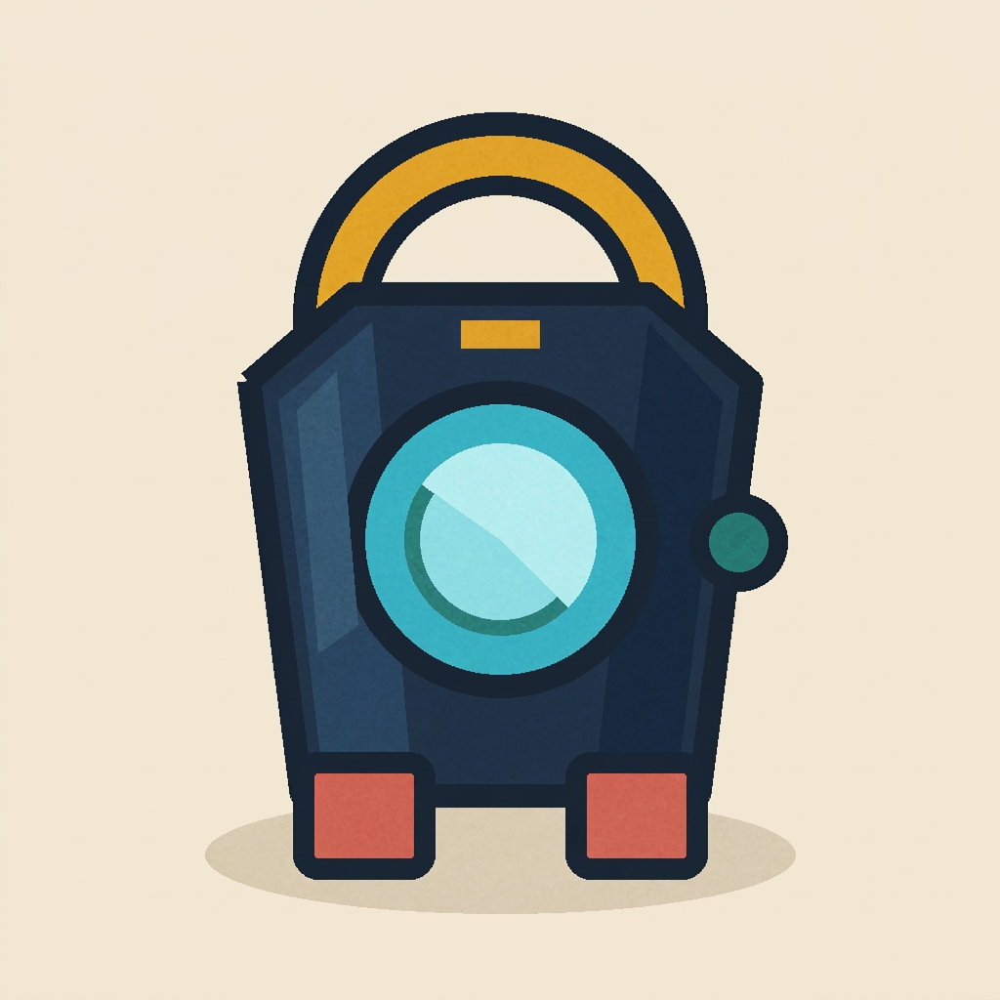
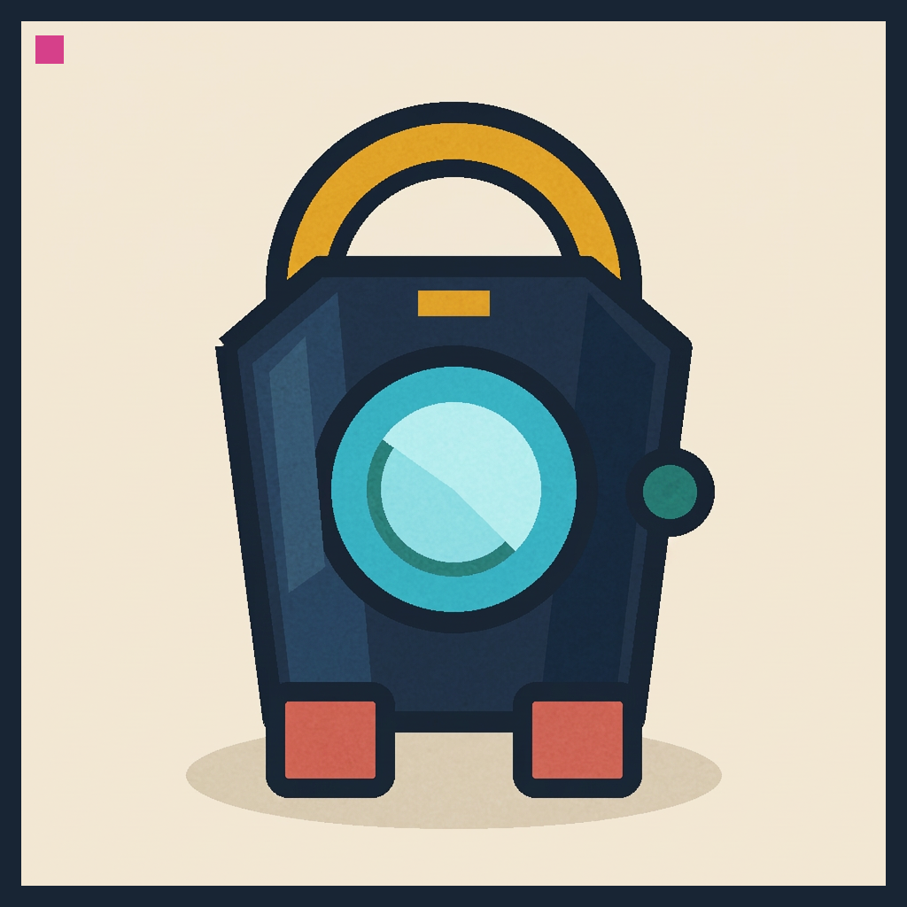

# Show and tell: generate, refuse, construct

LookProof does not generate images. It compiles or refuses a local request before a separate renderer is called. This generic signal-lantern study tests that boundary with independently reviewed pixels.

## Generative where reliable



The ordinary identity lock required one navy hexagonal lantern, one cyan lens, one amber arch handle, exactly two coral block feet, one teal circular knob, a warm cream field, and no readable text.

This source came from a Nano Banana Pro compiled condition in a bounded two-model study. An independent blind review returned **PASS** for the complete ordinary identity lock. The reviewer counted one lantern, one lens, one handle, two feet, and one knob, with no text, logo, watermark, duplicate part, clipping, or padding.

The study does not compare this image with a baseline on this page and does not establish that the compiled prompt caused the visual result. The image is a reviewed public example, not a keeper, authority, or production asset.

## Refuse where stochastic generation is the wrong tool

The same Look also declared an exact presentation lock:

- a 24-pixel charcoal border on all four edges;
- a 32 by 32 magenta registration square;
- the square's top-left pixel at coordinate 40, 40.

LookProof refused to represent that lock as a generative request:

```json
{
  "status": "fail",
  "gate": "deterministic-only-lock",
  "compiledRequest": null,
  "dispatched": false
}
```

The refusal happened before a renderer call. It created no image slot and no retry obligation. The checked-in [refusal diagram](refusal-flow.svg) shows the same control path with the public synthetic fixture.

## Construct exact geometry deterministically



After the ordinary source passed blind review, a local script created a separate derivative. The source bytes stayed unchanged.

Mechanical verification found:

- 96,000 border pixels with the exact declared color;
- 1,024 marker pixels with the exact declared color;
- zero border or marker mismatches;
- zero differences outside the declared border and marker regions.

A second independent visual review returned **PASS** for preservation. The border and marker did not touch, clip, duplicate, or obscure the lantern, lens, handle, feet, knob, body, outline, or ground shadow.

The deterministic pass proves exact construction and source preservation. It does not turn the derivative into production art or certify its taste.

## Fresh-user simulation

A separate process tested the public onboarding path without prior LookProof session context.

1. It cloned the public release, installed the locked dependencies, built the compiled CLI and MCP server, and ran the README preflight and demo.
2. A disposable Hermes profile started with no project memory, no bundled skills, no API credentials, and one contained LookProof MCP server.
3. The first run exposed working-directory, MCP-root, and tool-prefix friction. Those findings produced a tested README correction.
4. After the correction, the process completed the requested workflow in five MCP calls with zero failed calls, zero terminal calls, zero file writes, and `dispatched: false` in every LookProof verdict.

This was a controlled simulation, not external adoption. It shows that the current instructions are sufficient for a context-free process on the tested Windows setup.

## Renderer compatibility

A separate [renderer compatibility](renderer-compatibility.md) addendum records independently reviewed Google, Black Forest Labs, and xAI renderer routes that used the same local policy and refusal semantics. It reports bounded compatibility, not a quality ranking.

## What this proves

- LookProof can compile an ordinary provider-neutral request and record its inputs.
- LookProof can refuse exact work before dispatch.
- A separate renderer can still succeed or fail its visible obligations.
- Exact presentation geometry can be constructed and checked without asking the renderer to guess.
- Mechanical checks and independent visual review remain separate evidence.

LookProof still does not prove artistic correctness, model compliance, reproducibility, or production readiness.
